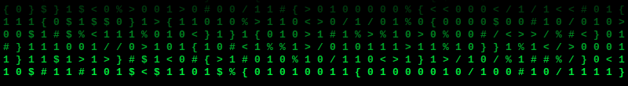

  
  
  

&nbsp;

## `>` Currently Learning

  
  

## `>` Portfolio & Contact

  
  

## `>` Connect With Me

  
  
  

## `>` Tools & Technologies

  

  

## `>` GitHub Stats

  
  

  

## `>` Trophy Cabinet

  

## `>` Contribution Snake

  

