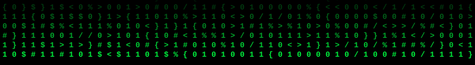

  
  
  
  

&nbsp;

## `>` About Me

  Full-Stack Developer with hands-on experience in <b>Laravel</b> and modern JavaScript frameworks like <b>React</b> and <b>Next.js</b>.
   
  I build reliable REST APIs, business web applications, and end-to-end features — from database design and
  backend architecture to responsive, interactive interfaces.
   
  Currently deepening my system design, DevOps, and testing practices while exploring AI-powered applications.

## `>` Core Stack

  
  
  
  
  
  

## `>` Skills &amp; Technologies

<b>Backend &amp; Languages</b>

  

<b>Frontend</b>

  

<b>Databases &amp; Caching</b>

  

<b>Tools &amp; DevOps</b>

  

## `>` Currently Learning

  
  
  

## `>` Portfolio &amp; Contact

  
  

## `>` Connect With Me

  
  
  

  

## `>` GitHub Stats

  
  

  

## `>` Trophy Cabinet

  

## `>` Contribution

  

